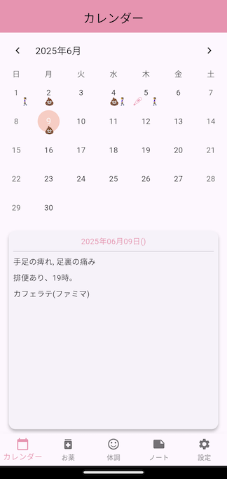

# dyphic
日々の体調管理をするために作成したアプリです。  
名称は`daily-physical-condition-app`からそれっぽく文字をとって付けましたが、表示アプリ名はシンプルに「体調管理」としています。  
扱うデータが個人情報なこともあり、不特定多数のユーザーに使ってもらうことは想定しておらずストアには公開していません。  

# アプリ作成の背景
家族など少数ですが複数の人が閲覧できる必要があったため、最初はGoogleスプレッドシートで体調情報を管理していました。  
最初からセルが切れていたりスプレッドーシートアプリの不満が対象あったのですが、情報量が多くなってくると閲覧の不便さが顕著になってきました。  
開いて編集するのも不便になり、外出先でも簡単に手軽に編集したい思いが強くなり、このアプリを作成しました。

# 画面イメージ
サンプル画像  

  

# 利用サービス
このアプリはFirebaseプロジェクトを使用しています。  

## FirebaseAuth
認証機能で`Sign-in method`のGoogleを有効にしています。  
未ログインの場合はデータの閲覧のみ許容し、ログインしていると各データの登録/編集を可能にしています。
実際にはアプリの実装と各サービスのルールで制御しています。

## Firestore
初期値は不要。アプリで保存したデータを登録・更新します。  

## Crashlytics
リリースビルドで作ったアプリでCrashlyticsへレポートを送信するようにしているので、有効にすることでクラッシュ情報がみれます。

## Storage
以下のような構成にしています。
 - images/
    - お薬登録/編集ページでカメラで撮った写真をアップする場所として使用しています。

