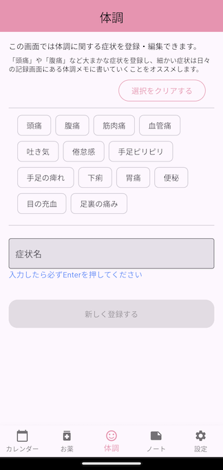

# dyphic
日々の体調管理をするために作成したアプリです。このアプリはFirebaseを利用しています。  

# 画面イメージ
サンプル画像  



# お薬情報の画像について
`Firebase Storage`の有料化に伴い、使えなくなったのでローカルで固定にします。
`/assets/images/medicines/`ディレクトリの中に`[id].jpeg`というファイルを置くと自動で読み込みます。

# 利用サービス
- FirebaseAuth
  - 認証機能で`Sign-in method`のGoogleを有効にしています。未ログインの場合はデータの閲覧のみ許容し、ログインしていると各データの登録/編集を可能にしています。
- Firestore
  - 初期値は不要です。アプリで保存したデータを登録・更新します。
- Crashlytics

# AAB作成
```
flutter build appbundle
```

# TODO
- イベント情報が反映できていない